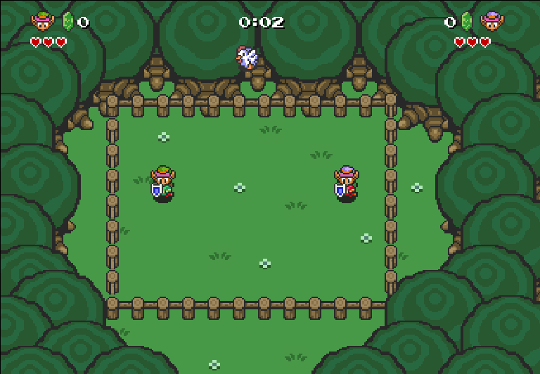

# ChickenDodge
This game is a project for a Game Engine course.

## How to launch the game
- NodeJS must be installed to launch this game.
- Type "npm install" in this directory to install the needed packages
- Type "node server.js" in this directory to launch the server
- Play in your browser by opening the link "http://localhost:8080/client/index.html" in 2 windows

